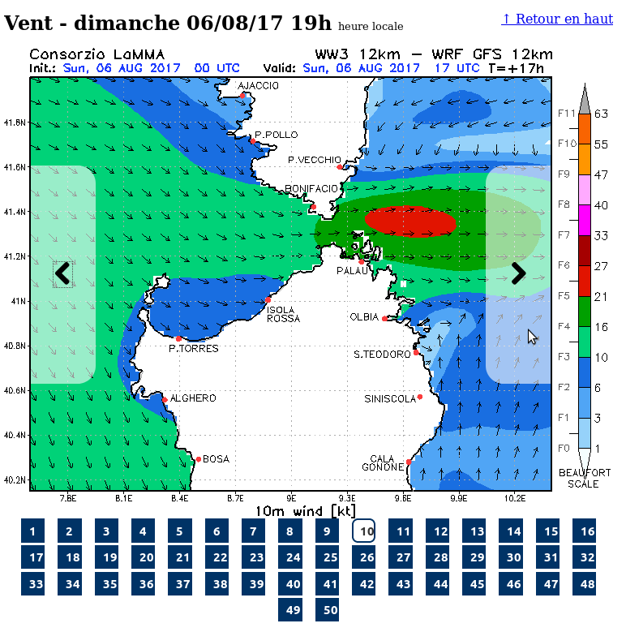
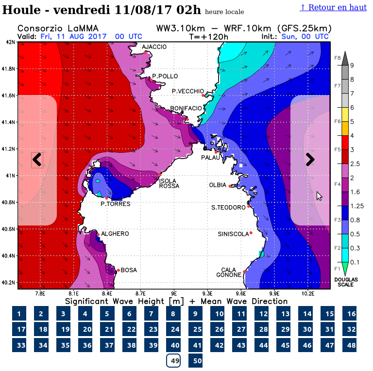

# Lamma2T

 A performance optimised and user-experience enhanced view of Consorzio Lamma Rete weather forecast for Bonifacio (France) / Maddalena archipelago (Italia)

## Issues encountered

Using [Lamma Rete weather forecast](http://www.lamma.rete.toscana.it/meteo/modelli/ventomare) I encounter two main issues :

* Getting accessing to the Bonifacio forecasts is tedious.
* The page is fat and slow, and moreover you have to make a new request for each new hour of the forecast, which is really annoying. This is particularly visible when you have a weak mobile internet access for instance at Santa Maria anchorage or Budelli.
* The page of the forecast contains lots of useless information, including heavy images, which slows down the loading of the page. Having to reload the page each time you want a new hour for the forecast, you have to be really zen before getting mad :)
* The page is not optimised for being viewed on mobile devices.
* Last, the mobile app of Lamma Rete doesn't solve any of these issues.

## Solutions brought by Lamma2T

Solve all the issues listed above by having a single page optimised, which means:

* All the hours of the forecast are loaded in **one time** (no more waiting between two hours of a forecast)
* Hours from the past are not displayed
* The hours of a forecast are translated to local time of Bonifacio / Maddalena (no more headaches computing the local hour wondering whether to add or subtract one or two hours)
* Getting to the next or previous hour of forecast is now easy, even on a tiny screen and with your big hairy and imprecise finger :)
* The images are much more lighter
* Loading time: increased by 66% (!)

Noteworthy info: all meteorological data is **NOT** modified by Lamma2t, it is exactly the same as on the original LammaRete site. (I have no legitimacy for weather forecasts, but [I think I do for web sites](http://www.linkedin.com/in/matthieufaure) ;) )

## Usage

Simply go to http://mm3g.ovh/ and follow the **Lamma2T** link.

## Weather forecast updates

LammaRete is updated at

* 7:30am UTC, 9:30am in summer, 8:30am in winter, based on the run of 0:00 UTC
* 9:30pm UTC, 11:30pm in summer, 10:30pm in winter, based on the run of 12:00 UTC

Lamma2T is updated:

* in the morning at 8:30am, 8:45am, 9:30am, 9:45am,
* in the evening at 10:30pm, 10:45pm, 11:30pm, 11:45pm

Detail of [LammaRete updates, in italian](http://www.lamma.rete.toscana.it/mare/modelli/ww3-info-sul-modello)

## Contribute

This is application is free opensource software licensed under aGPL. [Source code](https://gitlab.com/matt.faure/Lamma2t) can be browsed and any contribution is warmly welcome !

## Contact

matthieu2T AT stramanari.eu